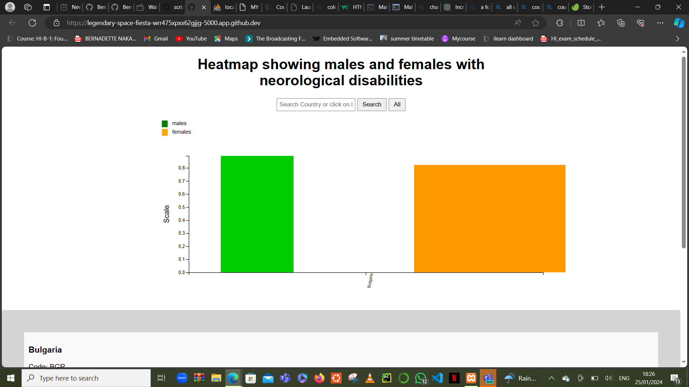

# Visualization of the development of neurological disabilities in females and males.

Neurological disabilities or disorders are very many and these days, they are rapidly increasing in the new borns and grown up people. It is believed that may be it is due to the mothers not caring much about themselves during pregnancy like going for antinatal care regularly or consulting their doctors before eating foods, taking some kinds medicine or even not sleeping enough. Some subtances have been heavily discouraged for mothers to use during pregnancy like alcohol or smoking and other drugs like cocain. 

Many mothers wonder why children develop neurological disorders before birth, during and after birth and even when growing too.  So many factors bring to these conditions. Some might be genital so, consulting doctors before giving birth or deciding to have a child is very crucial.
Others due to nutrition, environmental factors like climate, abuse, but all in all more research is needed.

## Goal of Visualization.

My visualization is mainly sending information to mothers in the world in order to make sure that they are literate about the possiblities of their children (unborn,born and grown-ups), developing neuorological disorders in case they don't take care of themselves or give enough care to their children. I have used the data for female and males so that I show the sex that is commonly affected by these disorders so that researchers can do more research on why a given sex is more affected and  why in that country or region so that to reduce the overall development of neurological disorders in the whole world.

## Usage of the visualization;

.png>)

In the above picture, the person can select a given country by typing in the text box and press on the search button. Below the searching part, is the heatmap  showing the development of the neurogical disorders in females(denoted in orange) and males(denoted in green). The x-axis shows the countries. 

### Clicking: 
          When the person clicks in the orange or green bars in the heatmap of a given country, he will be taken to another page where he will see the details of the neorological disability development  of that country, the country's flag and code(abbreviation of the country.) All these in a separate apart just below another heatmap showing the neorogical development in males and females of the country, and they will appear when one clicks on the bars of the heatmap(either green or orange)

        

###        Note: Some of the flags are not included in the images floder, so a default image will aappear. 

### The figures below show what a person sees on selecting a given counrty.

.png>)

## Target groups.

### Mothers:
         My visualization mainly focuses on mothers because they are solely responsible for the babies. No mother would like to see her child growing up with such disorder or developing one after growing up. Even if one grows up, he will still be taken care of and loved the same by their mothers.

         With this information, which I want mothers to know and do more research about these neurological disorders, is to help them live a happy life. Mothers are always happy when their children are healthy and happy.

### Researchers:
       My visualization also focus on researchers. This is because researchers in every country are needed to research about why the neurological disorders develop in both females and males and why in a given country or region a given sex is affected. The work of researchers, based on data they see from my visualization, they can help reduce the development of these disorders in a long run.
